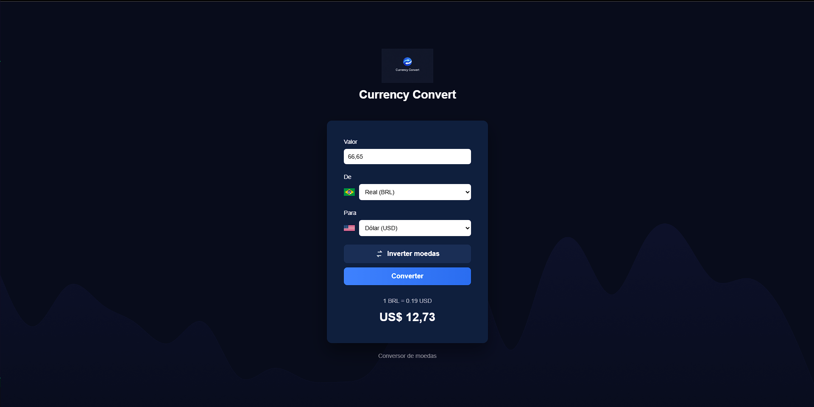

# Currency Convert

A simple and responsive **currency converter** built with **HTML, CSS and Vanilla JavaScript**.

This project allows users to convert currency values between different currencies using a clean and intuitive interface.

## Live Demo

https://theusan777.github.io/currency-convert-app/

## Preview



## Features

Real time currency conversion
Currency swap functionality
Automatic result update
Clean and modern interface
Responsive layout
Lightweight implementation with pure JavaScript

## Technologies Used

HTML5
CSS3
Vanilla JavaScript

## Project Structure

```
currency-convert-app
│
├── index.html
├── style.css
├── script.js
├── README.md
│
└── assets
    └── preview.png
```

## Installation

Clone the repository

```
git clone https://github.com/theusan777/currency-convert-app.git
```

Open the project folder

```
cd currency-convert-app
```

Open the `index.html` file in your browser.

No dependencies or build tools are required.

## Background Image Setup

The background image must be placed inside the `img` folder.

Example structure:

```
currency-convert-app
│
├── index.html
├── style.css
├── script.js
│
└── img
    └── bg.png
```

CSS reference used in the project:

```
body{
background: url("./img/bg.png") no-repeat center center;
background-size: cover;
}
```

Make sure:

* the folder name is `img`
* the file name is `bg.png`
* the folder is in the root of the project

## How to Use

1. Enter a value in the **amount field**
2. Select the **source currency**
3. Select the **target currency**
4. Click **Convert**

You can also use the **invert currencies** button to swap them instantly.

The converted value will appear below the button.

## What I Learned

During the development of this project I practiced:

* DOM manipulation
* JavaScript event handling
* Dynamic interface updates
* Frontend project structure
* Basic UI/UX design for web applications

## Future Improvements

Possible improvements for the project:

* Integration with a real exchange rate API
* More supported currencies
* Input formatting
* Dark / light theme toggle
* Improved mobile layout

## License

This project is open source and available under the MIT License.
